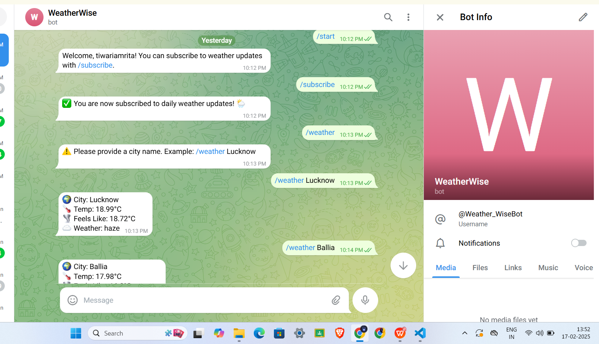

WeatherWiseBot 🌤️- Telegram Weather Bot with NestJS

📌 Project Overview

WeatherWiseBot is a Telegram bot built using NestJS that provides users with daily weather updates. It also includes an admin panel with Google Login authentication, allowing admins to manage bot settings and user accounts efficiently.

🚀 Features

🌤️ Daily Weather Updates

Users can subscribe to receive weather updates daily.

Weather data is fetched from a third-party weather API.

🔐 Admin Panel

Google Login authentication for secure access.

Admins can update bot settings (e.g., API keys, update intervals).

User management: block or delete users.

🛠 Tech Stack

Backend Framework: NestJS
Database: MongoDB (optional, for user management)
Authentication: Google OAuth2
Telegram Bot API: node-telegram-bot-api
Weather API: OpenWeatherMap (or another API of choice)
Frontend (Admin Panel): ReactJS / NestJS-based Admin Dashboard

📌 Telegram Bot Handle

@WeatherWiseBot

🔧 Installation & Setup

1️⃣ Clone the Repository

git clone [https://github.com/tiwari-amrita/AeroAlert.git]
cd WeatherWiseBot

2️⃣ Install Dependencies

npm install

3️⃣ Set Up Environment Variables

Create a .env file in the root directory and add the required API keys and credentials.

Example .env file:

TELEGRAM_BOT_TOKEN=your-telegram-bot-token

WEATHER_API_KEY=your-weather-api-key

GOOGLE_CLIENT_ID=your-google-client-id

GOOGLE_CLIENT_SECRET=your-google-client-secret

TELEGRAM_BOT_TOKEN: Create a bot using BotFather on Telegram.

WEATHER_API_KEY: Get it from OpenWeatherMap.

GOOGLE_CLIENT_ID & GOOGLE_CLIENT_SECRET: Generate OAuth2 credentials in the Google Developer Console.

4️⃣ Run the Bot Locally

npm run start
This starts the Telegram bot and the admin panel at http://localhost:3000.

5️⃣ Deploy the Bot (Optional)

For production deployment, use Docker or a cloud provider like Heroku, AWS, or Vercel.

🚀 Deployment

You can deploy the bot and admin panel using AWS, Vercel, Railway, or any cloud provider of your choice.

👨‍💻 Author

Amrita Tiwari

tiwariamrita2005@gmail.com

[https://www.linkedin.com/in/amrita-tiwari033617293]

📜 License

This project is licensed under the MIT License..

📷 Screnshotse

## 🌟 Screenshots
### 1️⃣ Bot in Action


### 2️⃣ Admin Panel


Here’s how the README file will look like in markdown format:

```markdown
# WeatherWiseBot 🌤️ – Your Daily Weather Companion on Telegram

## 📌 Project Overview
WeatherWiseBot is a powerful and user-friendly Telegram bot built using NestJS that provides users with daily weather updates, ensuring they’re always prepared for the day ahead. The bot also features an intuitive admin panel, secured with Google Login authentication, to efficiently manage bot settings and user accounts.

## 🚀 Key Features

### 🌤️ Daily Weather Updates
- **Get timely weather forecasts** delivered to your Telegram every day.
- **Reliable data fetched** from a trusted third-party weather API (OpenWeatherMap or your preferred choice).

### 🔐 Admin Panel
- **Secure Google Login Authentication** to access and manage the admin panel.
- **Manage Bot Settings**: Easily update API keys, configure update intervals, and more.
- **User Management**: Block or delete users directly from the admin dashboard.

## 🛠 Tech Stack
- **Backend Framework**: NestJS
- **Database**: MongoDB (optional for user management)
- **Authentication**: Google OAuth2
- **Telegram Bot API**: `node-telegram-bot-api`
- **Weather API**: OpenWeatherMap (or another API of your choice)
- **Admin Panel Frontend**: ReactJS / NestJS-based Admin Dashboard

## 📌 Telegram Bot Handle
[@WeatherWiseBot](https://t.me/WeatherWiseBot)

---

## 🔧 Installation & Setup

### 1️⃣ Clone the Repository
```bash
git clone https://github.com/tiwari-amrita/WeatherWiseBot.git
cd WeatherWiseBot
```

### 2️⃣ Install Dependencies
```bash
npm install
```

### 3️⃣ Set Up Environment Variables
Create a `.env` file in the root directory and add your required API keys and credentials.

Example `.env` file:

```
TELEGRAM_BOT_TOKEN=your-telegram-bot-token
WEATHER_API_KEY=your-weather-api-key
GOOGLE_CLIENT_ID=your-google-client-id
GOOGLE_CLIENT_SECRET=your-google-client-secret
```

- **TELEGRAM_BOT_TOKEN**: Create a bot using [BotFather](https://core.telegram.org/bots#botfather) on Telegram.
- **WEATHER_API_KEY**: Get it from [OpenWeatherMap](https://openweathermap.org/api).
- **GOOGLE_CLIENT_ID & GOOGLE_CLIENT_SECRET**: Generate OAuth2 credentials in the [Google Developer Console](https://console.developers.google.com/).

### 4️⃣ Run the Bot Locally
```bash
npm run start
```
- This will start the Telegram bot and the admin panel at `http://localhost:3000`.

### 5️⃣ Deploy the Bot (Optional)
For production deployment, you can use Docker or deploy on cloud platforms like AWS, Vercel, or Railway.

---

## 🚀 Deployment
You can easily deploy WeatherWiseBot and the admin panel on any cloud platform of your choice, such as **AWS**, **Vercel**, **Railway**, or others.

---

## 👨‍💻 Author
**Amrita Tiwari**  
[LinkedIn](https://www.linkedin.com/in/amrita-tiwari033617293)  
📧 tiwariamrita2005@gmail.com

---

## 📜 License
This project is licensed under the MIT License.

---

## 📷 Screenshots


You can copy this into a `README.md` file for your project!
